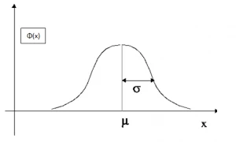
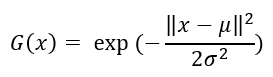
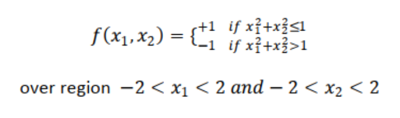
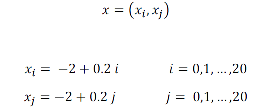
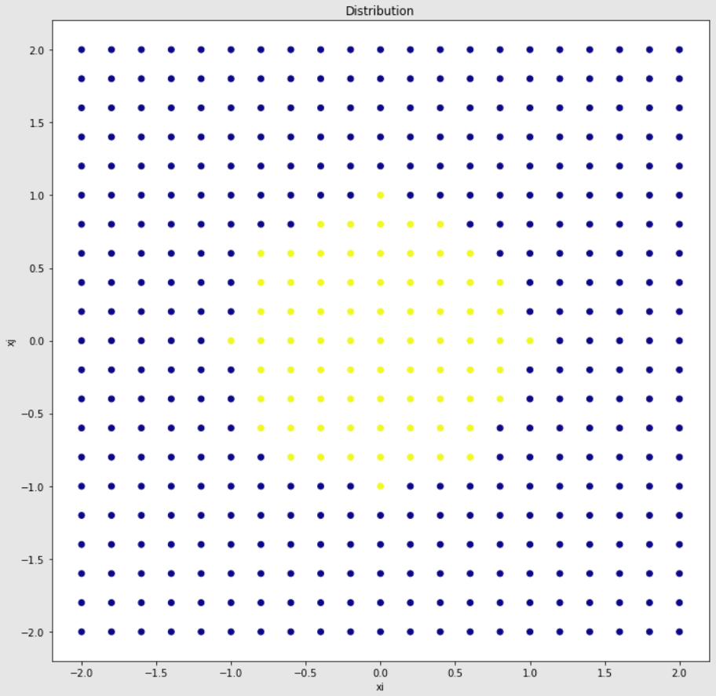
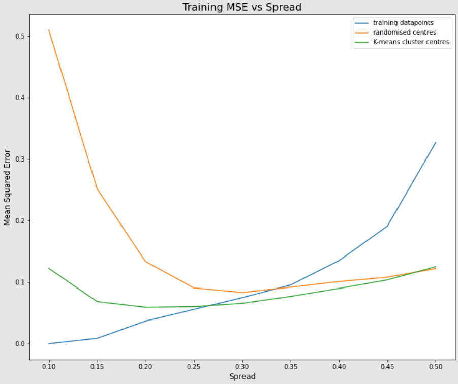
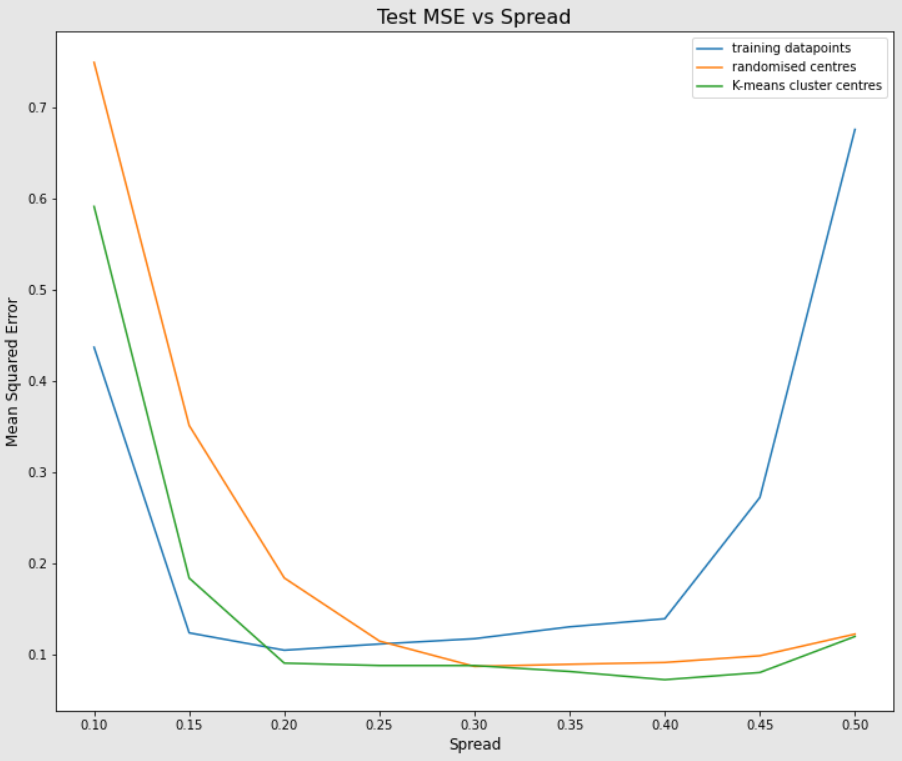

# RBF Neural Network

A Radial Basis Function (RBF) neural network is a specialised type of feedforward neural network formulated by Broomhead and Lowe in 1988, that uses radial basis functions as its activation function. It only has one hidden layer with activation with no weights between the input and hidden layer. It aims to perform function approximation and mapping non-linear behaviour of static processes. Conceptually, it is quite similar to a kernel SVM as it maps a non-linearly separable dataset into a different (lower or higher) dimension using the a radial basis function to find a linear separator. Clearly, it is only used for classification tasks due to the inherent architecture.  

## Gaussian RBF

  

Here, we see a Gaussian radial basis function. Mathematically, it is given as

  

Clearly, *mu* is the centre and *sigma* is the standard deviation of the Gaussian. For the RBF, the *sigma* values for the activation functions of the neurons in the hidden layer are called spread parameter which along with the *mu* values constitute hyperparameters for our model. They can be set manually by the user using standardised values or calculated using statistical methods.

## Problem statement

In this repo, we aim to use an RBF NN to approximate a simple function defined as follows

  

We use 441 input samples, defined below

  

The resulting distribution is plotted.

  

The data is split using the `train_test_split()` function from the *Scikit-Learn* library into 2 parts with a ratio 8:2, one for training and one for testing. The training set has 352 observations while the test set has 89.

## Hyperparameter Selection

We implement 3 different approaches
- All training points are set as centres for the activation function of the hidden neurons. This means that the hidden layer will have 352 neurons, equal to the number of training points. The spread parameter is kept constant for all neurons, and we aim to compare the performance as this constant spread parameter is varied.
- 150 random data points are selected to be the centres, resulting in 150 hidden neurons. Again, the spread parameter is constant for all neurons and varied along a defined range to present a comparison.
- 150 centres are calculated using K-means Clustering algorithm, which is a widely used unsupervised machine learning technique. The spread parameter is defined just like the above 2 approaches. 

The spread parameter is varied from 0.1 to 0.5 in increments of 0.05.

## Graphical Comparison

The metric chosen for comparison is Mean Squared Error (MSE) since our objective is to observe how best can the network approximate the function.

  

  

## File Descriptions:

The Jupyter Notebook titled *rbfnn.ipynb* is the main file with all the code implementation and graphical representation. A *report.pdf* is also uploaded that goes deeper into deducing the results obtained. All image files are to supplement this README.